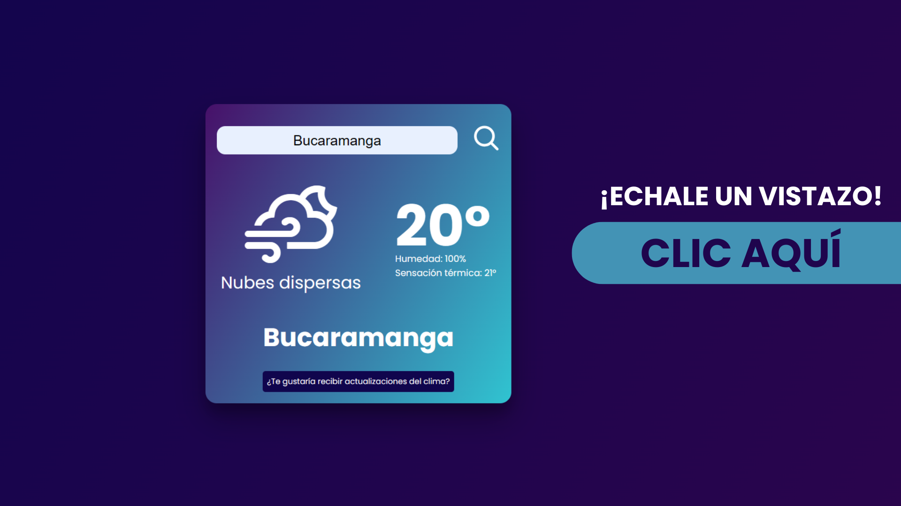
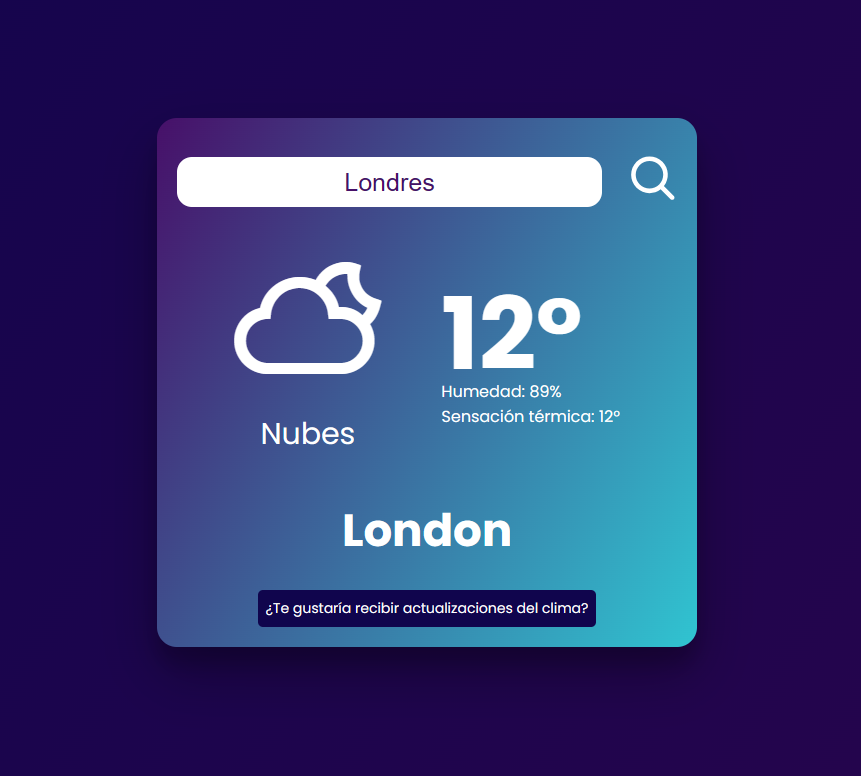
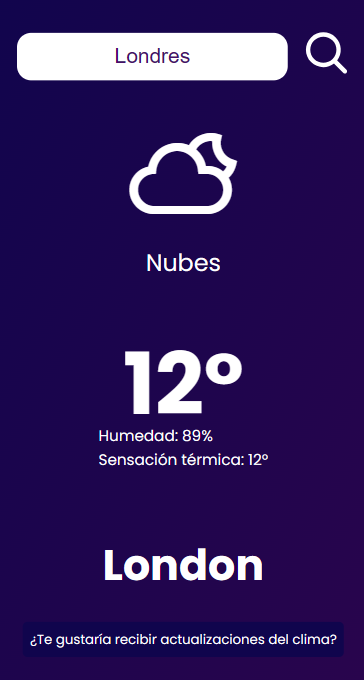

# MiClima App

 

Este proyecto fue una prueba tecnica para trabajar como Developer Frontend Junior en Skolmi *(Spoiler: Me dieron el puesto - Mayo 2024)*
consistía en hacer una app web que consumiera los datos de una API (WeatherMap) para ver el clima usando Next Js, además evaluarían el deploy, las buenas prácticas, el responsive, el diseño, la funcionalidad...

 
Cuando entregué la prueba aún le faltaban cosas que en su momento no sabía hacer bien, hoy echo un vistazo hacia atrás y veo como lo que me costó tanto hace unos meses ahora es un proceso sencillo y bien aprendido,
por eso me permití hacerle un par de mejoras para corregir los pendientes que dejé.

## Un vistazo
### Desktop:

### Mobile:

 

## Diseño
Yo mismo he realizado el diseño con mis conocimientos en Figma y en UI/UX buscaba un diseño minimalista y sobrio que reflejara la sencillez de esta app sin parecer "Pobre" 
> [!TIP]
> Mira el figma que diseñé [Haciendo clic aquí.](https://www.figma.com/file/dbnKy1WVecTzvRZ4MeANDp/Mi-Clima-app?type=design&node-id=1%3A2&mode=design&t=NfmpAskeHC2st6xd-1).

 

## ¿Qué aprendí y que me falta?
Aprendí los principios de React y a consumir una API, usar Next Js y trabajar Next Js con CSS y no con Tailwind (aunque Tailwind me gusta más).
Las siguientes features que tengo en mente son:
- Enviar correos electrónicos con el informe del clima.
- Mejorar detallitos de la UI.

 

## Créditos:
Para la funcionalidad y estetica de esta app se utilizaron diferentes herramientas:

- [**OpenWeatherMap**](https://openweathermap.org/api) La Api del clima.

- [**Weather Icons**](https://erikflowers.github.io/weather-icons/) Los iconos que usa la app han sido tomados del trabajo de Erik Flowers. Un diseño más minimalista y amigable que el proporcionado por la API.
